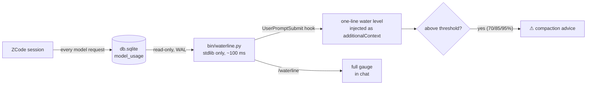

<div align="center">

# ⛽ token-waterline

**A live token water-level gauge for [ZCode](https://github.com/zai-org/ZCode) sessions.**

Know how much context you've burned, how much is left, and when to compact — *before* the ceiling hits.

[](https://github.com/mechanic-Q/token-waterline/actions/workflows/ci.yml)
[](LICENSE)


[English](./README.md) · [简体中文](./README.zh-CN.md)


</div>

---

## Why

ZCode (like every coding agent) **resends the entire conversation on every turn**. In a long
research session we watched it quietly burn **271.9M input tokens across 697 requests**
(~390K per request) — and ZCode has no built-in way to answer, *in real time*:

- *"How much has this session already burned?"*
- *"At the current pace, how many turns are left before the context window fills up?"*

Afterwards you can dig through logs; during the session you're flying blind.
token-waterline is the missing gauge: a hook that keeps a live water level in front of you
and warns you to compact **before** an emergency compaction eats your context.

## Features

- 🔥 **Burn meter** — total input tokens consumed by the session (cache re-sends and
  subagents included — the same number your quota sees), plus request count, average
  per request, output tokens, and burn rate per minute.
- 🌊 **Water level** — latest main-thread context size vs. the model's context window,
  rendered as a bar with percentage.
- ⏳ **Turns-left estimate** — remaining headroom ÷ average context growth of the last
  10 turns, with the single-turn peak called out.
- 🧹 **Compaction aware** — detects context resets (>50% drops) and reports how many
  compactions happened and how long ago.
- 🤖 **Subagent split** — main thread vs. subagent burn, so you can see what exploration
  actually costs.
- 💬 **Auto-injection** — a ~25-token one-liner is injected into context on every prompt;
  escalates to compaction advice at 70% / 85% / 95%.
- ⚡ **Zero dependencies** — pure Python standard library, read-only SQLite access,
  ~100 ms per invocation.

## Quick start

```bash
git clone https://github.com/mechanic-Q/token-waterline.git
cd token-waterline
./install.sh          # idempotent; backs up your config first
```

`install.sh` does three things:

1. Merges hooks into `~/.zcode/cli/config.json` (backs it up first): a
   `UserPromptSubmit` hook on every prompt, and a `SessionStart` hook on
   `resume|compact` — both spawn the engine directly (`type: "process"`, no shell).
2. Installs the `/waterline` slash command to `~/.zcode/commands/`.
3. Writes default thresholds to `~/.zcode/token-waterline.json`.

That's it. New ZCode sessions now show a live water line:

```
[token-waterline] [Token水位] 73.6% (736.1K/1.0M)｜本会话已烧 274.8M｜剩余≈13轮｜⚠ 水位≥70%：建议收尾规划，考虑 /compress 或开新会话
```

Below 70% it's a quiet one-liner; at 70 / 85 / 95% it escalates to compaction advice.

### Manual inspection

Type `/waterline` in any ZCode session for the full gauge (add `burn` for a
main-thread/subagent breakdown), or call the engine directly:

```bash
python bin/waterline.py                    # gauge for the most recent session in this directory
python bin/waterline.py --list             # list the 15 most recent sessions
python bin/waterline.py --session <id>     # a specific session
python bin/waterline.py --format json      # machine-readable
python bin/waterline.py --format line      # one-liner
```

### Uninstall

```bash
./uninstall.sh     # removes only what this tool added
```

## How it works



- **Data source** — ZCode records every model request in `~/.zcode/cli/db/db.sqlite`
  (table `model_usage`: input/output/cache tokens, `query_source`, model, timestamps).
  The engine opens it read-only; WAL mode means it never blocks a running session.
- **Context limits** — resolved from `~/.zcode/v2/config.json`
  (`provider.*.models.*.limit.context`), so any provider/model you configured works
  automatically. Unlisted models fall back to a configurable default.
- **Session resolution** — `--session` flag → `CLAUDE_SESSION_ID`/`ZCODE_SESSION_ID`
  env → hook stdin payload → most recent active session matching your current
  working directory.

### The numbers, precisely

| Metric | Definition |
|---|---|
| Burned | Σ `input_tokens` over **all** completed requests of the session (cache reads included — this is what your quota sees), split by main thread / subagent / auxiliary |
| Water level | latest `main_turn` request's `input_tokens` ÷ model context limit |
| Turns left | remaining headroom ÷ mean positive context delta of the last 10 main turns |
| Compaction | any main-turn context drop > 50% counts as one; gauge shows count and turns since the last |

## Configuration — `~/.zcode/token-waterline.json`

```jsonc
{
  "warn": 70,               // escalation thresholds (%)
  "alert": 85,
  "critical": 95,
  "inject": "always",       // always | threshold (only above warn) | off
  "default_context_limit": 1000000,   // fallback for models not in ZCode's config
  "model_limits": {},       // manual override, e.g. {"glm-5-turbo": 200000}
  "debug": false            // keep timestamped debug captures
}
```

## FAQ

**Does the injected line itself cost tokens?**
~25–40 per prompt. Against a long session's hundreds of thousands of tokens per
request, it's noise — and `"inject": "threshold"` silences it until it matters.

**Is the water level delayed?**
By up to one turn: usage rows are written when a request completes.

**Windows / macOS / Linux?**
The engine is pure stdlib Python and the hooks use `type: "process"` (no shell).
Developed on Windows; paths follow `~/.zcode` on every platform.

**Verified hook payload (ZCode 0.16.5).** The official docs don't document the hook
stdin schema; empirically it carries both naming conventions:
`session_id`/`sessionId`, `transcript_path`/`transcriptPath`, `cwd`,
`prompt`, `hook_event_name`/`hookEventName`, `permission_mode`, `trace_id`, `turn_id`.
ZCode also sets `CLAUDE_SESSION_ID` in the hook's environment. The engine resolves
the session from these, falling back to cwd matching. Note hooks are snapshotted at
session start — restart a session after changing hook config.

**Why not just show it in a status line?**
ZCode has no status-line hook today. The `additionalContext` injection is the one
channel that reaches both you *and* the model — so the model itself can act on the
warning (wrap up, summarize, compact).

## Contributing

Issues and PRs welcome. Keep the engine stdlib-only and single-file — that's a feature.

## License

[MIT](LICENSE) © 2026 mechanic-Q
