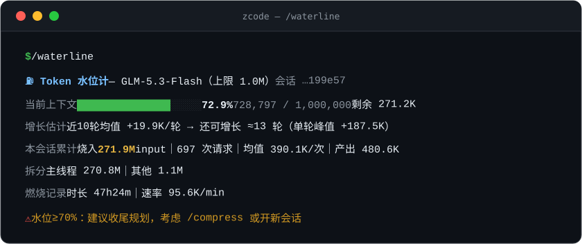
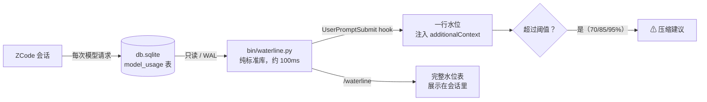

<div align="center">

# ⛽ token-waterline

**给 [ZCode](https://github.com/zai-org/ZCode) 会话装一个实时的 Token 水位计。**

这个会话已经烧了多少？按当前速度还剩多少？什么时候该压缩？——在触顶**之前**回答。

[](https://github.com/mechanic-Q/token-waterline/actions/workflows/ci.yml)
[](LICENSE)


[English](./README.md) · [简体中文](./README.zh-CN.md)



</div>

---

## 为什么需要它

ZCode（和所有编码 agent 一样）**每一轮都把全部上下文重新发送一遍**。一次长研发会话里，
我们眼睁睁看着它悄悄烧掉了 **271.9M input tokens（697 次请求，均值约 39 万/次）**——
而 ZCode 没有任何内置手段能实时回答：

- "这个会话已经烧了多少 token？"
- "按当前速度，还有几轮上下文就满了？"

事后能翻日志慢慢数；会话中只能盲飞。token-waterline 就是缺的那块仪表：
一个 hook 把实时水位摆在眼前，**在紧急压缩吃掉你的上下文之前**提醒你该收尾了。

## 功能

- 🔥 **燃烧计量** — 本会话累计烧入的 input tokens（含 cache 重发、含子 agent，与额度消耗同口径），
  以及请求数、单次均值、产出 tokens、每分钟燃烧速率。
- 🌊 **水位计** — 最近一次主线程请求的上下文规模 ÷ 模型 context 上限，进度条 + 百分比。
- ⏳ **剩余轮数估算** — 剩余额度 ÷ 近 10 轮平均上下文增量，并标注单轮峰值。
- 🧹 **压缩感知** — 识别上下文骤降（>50%），标注"含 N 次压缩、距上次 X 轮"。
- 🤖 **子 agent 拆分** — 主线程 vs 子 agent 各烧多少，探索成本一目了然。
- 💬 **自动注入** — 每轮往上下文注入约 25 token 的一行水位；70% / 85% / 95% 三档升级为压缩建议。
- ⚡ **零依赖** — 纯 Python 标准库，只读访问 SQLite，单次约 100ms。

## 快速开始

```bash
git clone https://github.com/mechanic-Q/token-waterline.git
cd token-waterline
./install.sh          # 幂等；安装前自动备份你的配置
```

`install.sh` 做三件事：

1. 把 hooks 合并进 `~/.zcode/cli/config.json`（先备份）：每轮触发的 `UserPromptSubmit`
   + 恢复/压缩时触发的 `SessionStart`——都是 `type: "process"` 直接拉起引擎，不经过 shell。
2. 安装 `/waterline` 斜杠命令到 `~/.zcode/commands/`。
3. 写默认阈值配置 `~/.zcode/token-waterline.json`。

完成。新开的 ZCode 会话从此有实时水位：

```
[token-waterline] [Token水位] 73.6% (736.1K/1.0M)｜本会话已烧 274.8M｜剩余≈13轮｜⚠ 水位≥70%：建议收尾规划，考虑 /compress 或开新会话
```

低于 70% 是安静的一行播报；70 / 85 / 95% 三档逐步升级为压缩建议。

### 手动查看

任意 ZCode 会话里输入 `/waterline` 看完整水位表（加 `burn` 参数看主线程/子 agent 拆解），
或直接调引擎：

```bash
python bin/waterline.py                    # 当前目录最近会话的水位表
python bin/waterline.py --list             # 列出最近 15 个会话
python bin/waterline.py --session <id>     # 指定会话
python bin/waterline.py --format json      # 机器可读
python bin/waterline.py --format line      # 单行摘要
```

### 卸载

```bash
./uninstall.sh     # 只移除本工具添加的内容
```

## 工作原理



- **数据源** — ZCode 把每次模型请求记在 `~/.zcode/cli/db/db.sqlite`
  （`model_usage` 表：input/output/cache tokens、`query_source`、模型、时间戳）。
  引擎以只读模式打开；WAL 模式下绝不阻塞正在运行的会话。
- **上下文上限** — 从 `~/.zcode/v2/config.json` 解析
  （`provider.*.models.*.limit.context`），你配置的任何 provider/模型都自动适配；
  未收录的模型回退到可配置的默认值。
- **会话定位** — `--session` 参数 → `CLAUDE_SESSION_ID`/`ZCODE_SESSION_ID` 环境变量
  → hook stdin payload → 当前工作目录下最近活跃的会话。

### 指标口径

| 指标 | 定义 |
|---|---|
| 已烧多少 | 该会话**全部** completed 请求的 Σ`input_tokens`（含 cache 读——与额度消耗同口径），按主线程/子 agent/辅助请求拆分 |
| 水位 | 最近一次 `main_turn` 请求的 `input_tokens` ÷ 模型 context 上限 |
| 剩余轮数 | 剩余额度 ÷ 近 10 个主线程轮次的正增量均值 |
| 压缩 | 主线程上下文骤降 >50% 记一次；标注总次数与距上次压缩的轮数 |

## 配置 — `~/.zcode/token-waterline.json`

```jsonc
{
  "warn": 70,               // 升级阈值（%）
  "alert": 85,
  "critical": 95,
  "inject": "always",       // always=每轮注入 | threshold=仅超阈值注入 | off=关闭
  "default_context_limit": 1000000,   // ZCode 配置里没有的模型的兜底上限
  "model_limits": {},       // 手动覆盖，如 {"glm-5-turbo": 200000}
  "debug": false            // 保留带时间戳的调试留痕
}
```

## FAQ

**注入的一行水位本身不也耗 token 吗？**
每轮约 25–40 个。相比长会话单轮几十万的请求量是噪音——而且 `"inject": "threshold"`
可以让它直到关键时刻才开口。

**水位有延迟吗？**
最多一轮：usage 在请求完成后才落库。

**支持 Windows / macOS / Linux 吗？**
引擎是纯标准库 Python，hooks 用 `type: "process"`（不经 shell）。在 Windows 上开发；
所有平台都遵循 `~/.zcode` 路径约定。

**为什么不做成状态栏？**
ZCode 目前没有 statusline 机制。`additionalContext` 注入是唯一同时能到达**你和模型**的
通道——模型自己也能看到水位并据此行动（收尾、总结、压缩）。

## 参与贡献

欢迎 Issue 和 PR。请保持引擎只用标准库、单文件——这是特性不是限制。

## 许可证

[MIT](LICENSE) © 2026 mechanic-Q
